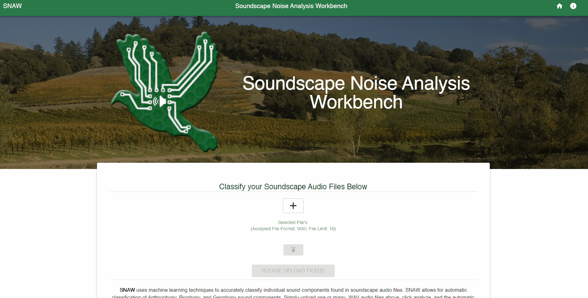
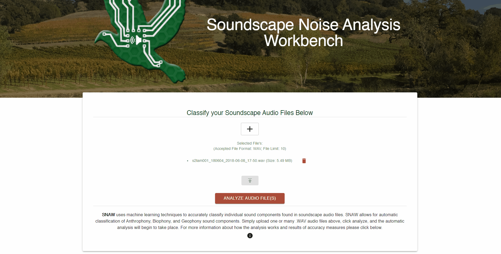

# intellichirp-snaw
## Soundscape Noise Analysis Workbench

[Demo](https://github.com/intelliChirp/SNAW)

[Team Website](https://www.cefns.nau.edu/capstone/projects/CS/2020/IntelliChirp-S20/)

## Description

### Problem
Various environmental changes affect a range of species around the world and as more species are being affected, proper management and observation are required to understand their response. Traditional field methods require trained observers to determine species presence/absence and are thus expensive and challenging to employ at large scales. Using sound to monitor biodiversity across landscapes is a fairly recent development.

Our clients are working with [Soundscapes2Landscapes](https://soundscapes2landscapes.org/). They are having a problem with an un-user friendly application that requires manual identification in terabytes of sound files. This manual approach is incredibly time consuming and needs to be automated. We feel confident that we can provide a solution that is user friendly and automates that identification process with machine learning.

### Solution

Our envisioned solution is a user friendly web application for use by any researcher or citizen scientist. This application is called the Soundscape Noise Analysis Workbench (S.N.A.W.), and will allow users to analyze sound files with the power of machine learning. The results given to the users include a summary of the audio components in the file, acoustic indices, and an export of the sound file with background noise masked out. Users will gain a better understanding of how various sources of noise in soundscape recordings diminish the ability to detect individual bird species and quantify avian diversity. Using machine learning, instead of the current manual identification process, will drastically speed up the identification of terabytes of acoustic data. This solution will allow users anywhere, anytime, to upload their soundscapes for noise analysis, quickly.

## Installation

Install Python (version 3.7.4) from: 
https://www.python.org/downloads/release/python-374/2.

Make sure Pip is up-to-date. Run command: 
~~~~
py -m pip install --upgrade pip3
~~~~

Navigate to the directory where you would like to install the virtual environment. Run command:
~~~~
py -m venv snaw 
~~~~
(change ‘snaw’ to what you would like to name the virtual environment).

Activate the environment by navigating to the file directory of your environment and running command 
~~~~
.\Scripts\activate
~~~~

Verify that the virtual environment is running by looking on the left hand side of the bottom line. You should see the name of your virtual environment in parenthesis (Ex:(snaw) C:\......)7. Visit SNAW’s ‘Installation_Requirements’ repository at: https://github.com/intelliChirp/Installation_Requirements . 

Click the green ‘Clone or download’ button. 

Click on ‘Download ZIP’. 

Copy requirements.txt file to your virtual environment directory. 

Navigate to your virtual environment’s directory. Type the command: 
~~~~
pip install -r requirements.txt
~~~~
Wait for the packages to install on your local machine

## Running Locally

Click on the green ‘Clone or download’ button.

With a terminal open, navigate to the file directory of your Python virtual environment. 

Activate the virtual environment by running 
~~~~
\Scripts\activate
~~~~
Navigate to the web application’s repository on your local machine.

Navigate to /SNAW/snaw-frontend

Type the commands:
~~~~
npm install
npm run build
~~~~
This will install all needed packages for this application.

Navigate to the file directory /SNAW/snaw-backend

Type the command 
~~~~
py api.py
~~~~
This will start the server on your machine. The last line printed to the terminal should show:‘Running on http://127.0.0.1:5000/ (Press CTRL+C to quit)’

Open a web browser, and paste ‘​http://127.0.0.1:5000/​’ into the URL.

You should now be at the homepage of SNAW

## Technology Demo

Here are a couple screenshots from our demo.

### Uploading audio for analysis

### Analyze the audio and give results

### Visualizing results from analysis

### Export acoustic indices as csv file

## Authors

* **Steven Enriquez** - *Team Lead, Front-End Lead* - [GitHub](https://github.com/stevenenriquez)
* **Michael Ewers** - *Back-End Lead* - [GitHub](https://github.com/MEwers96)
* **Joshua Kruse** - *Machine Learning Lead* - [GitHub](https://github.com/JoshEKruse)
* **Zhenyu Liei** - *Testing Lead* - [GitHub](https://github.com/lei37927)

## Acknowledgments

* **Colin Quinn.** - *Client*
* **Patrick Burns.** - *Client*

School of Informatics, Computing and Cyber Systems
Global Earth Observation and Dynamics of Ecosystems Lab

* **Soundscapes 2 Landscapes** - [Website](https://soundscapes2landscapes.org/)
